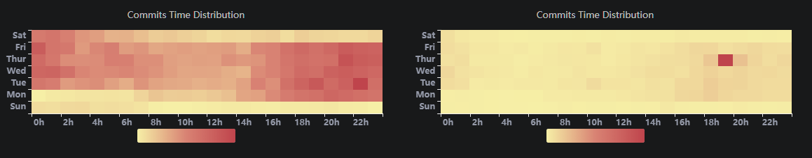
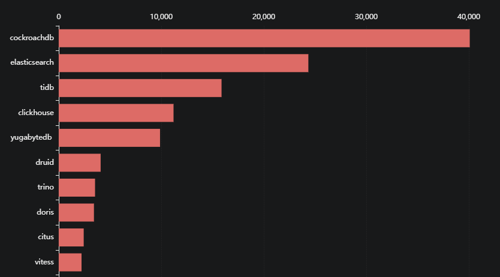

4.6 billion is literally an astronomical figure. The richest star map of our galaxy, brought by Gaia space observatory, includes just under 2 billion stars. What does a view of 4.6 billion GitHub events really look like? What secrets and values can be discovered in such an enormous amount of data? 

**Here you go: [OSSInsight.io](https://ossinsight.io/) **can help you find the answer**.** It’s a useful insight tool that can give you the most updated open source intelligence, and help you deeply understand any single GitHub project or quickly compare any two projects by digging deep into 4.6 billions GitHub events in real time.  

## Compare any two GitHub projects

Do you wonder how different projects have performed and developed over time? Which project is worthy of more attention? **[OSSInsight.io](https://ossinsight.io/)** can answer your questions via the [Compare Projects](https://ossinsight.io/compare/) page.

Let’s take the [Kubernetes repository](https://github.com/kubernetes/kubernetes)  (K8s) and Docker’s [Moby repository](https://github.com/moby/moby) as examples and compare them in regard to popularity and coding vitality. 


### **Popularity**

To compare the popularity of two repositories, we use multiple metrics including the number of stars, the growth trend of stars over time, and stargazers’ geographic and employment distribution. 

#### **Number of stars**

The line chart below shows the accumulated number of stars of K8s and Moby each year. According to the chart, Moby was ahead of K8s until late 2019. The star growth of Moby slowed after 2017 while K8s has kept a steady growth pace. 


<center><em>The star history of K8s and Moby</center></em>


#### **Geographical distribution of stargazers**

The map below shows the stargazers’ geographical distribution of Moby and K8s. As you can see, their stargazers are scattered around the world with the majority coming from the US, Europe, and China.


<center><em>The geographical distribution of K8s and Moby stargazers</em></center>

#### **Employment distribution of stargazers**

The chart below shows the stargazers’ employment of K8s (red) and Moby (dark blue). Both of their stargazers work in a wide range of industries, and most come from leading dotcom companies such as Google, Tencent, and Microsoft. The difference is that the top two companies of K8s’ stargazers are  Google and Microsoft from the US, while Moby’s top two followers are Tencent and Alibaba from China. 


<center><em>The employment distribution of K8s and Moby stargazers</em></center>

<!--truncate-->

### **Coding vitality**

To compare the coding vitality of two GitHub projects, we use many metrics including the growth trend of pull requests (PRs), the monthly number of PRs, commits and pushes, and the heat map of developers’ contribution time. 

#### **Number of commits and pushes**

The bar chart below shows the number of commits and pushes submitted to K8s (top) and Moby (bottom) each month after their inception. Generally speaking, K8s has more pushes and commits than Moby, and their number grew stably until 2020 followed by a slowdown afterwards. Moby’s monthly pushes and commits had a minor growth between 2015 and 2017, and then barely increased after 2018.


<center><em>The monthly pushes and commits of K8s (top) and Moby (bottom)</em></center>

#### **Number of PRs**

The charts below show the monthly and accumulated number of PRs of the two repositories. As you can see, K8s has received stable and consistent PR contributions ever since its inception and its accumulated number of PRs has also grown steadily. Moby had vibrant PR submissions before late 2017, but started to lose afterwards. Its accumulated number of PRs reached a plateau in 2017, which has remained the case ever since. 


<center><em>The monthly and accumulated PR number of K8s (top) and Moby (bottom)</em></center>

#### **Developers’ contribution time**

The following heat map shows developers’ contribution time for K8s (left) and Moby (right). Each square represents one hour in a day. The darker the color, the more contributions occur during that time. K8s has many more dark parts than Moby, and K8s’ contributions occur almost 24 hours a day, 7 days a week. K8s definitely has more dynamic coding activities than Moby. 




<center><em>Heat map of developers’ contribution time of K8s (left) and Moby (right)</em></center>

<br />
**Taken together,** these metrics show that while both K8s and Moby are popular across the world and industries, K8s has more vibrant coding activities than Moby. K8s is still gaining popularity and coding vitality; however, Moby is falling in both over time.

Popularity and coding vitality are just two dimensions to compare repositories. If you want to discover more insights or compare other projects you are interested in, feel free to visit the [Compare](https://ossinsight.io/compare/) page and explore it for yourself.  Of course, you can also use this  page to **deeply explore any single GitHub projects** and gain the most up-to-date insights about them.


## Key open source insights

[OSSInsight.io](https://ossinsight.io/) does more than explore or compare repositories. **It gives you [historical, real-time, and custom open source insights](https://ossinsight.io/database/deep-insight-into-open-source-databases).** In this section, we’ll share some key insights in open source databases and programming languages. If you want to gain insights in other areas, you can go to the [Insight](https://ossinsight.io/_/database/?utm_source=dogfood_article) page. 

**Note**: If you want to get those analytical results by yourself, you can execute the SQL commands above each chart on TiDB Cloud with ease following this [5-minute tutorial](https://ossinsight.io/blog/try-it-yourself/). 


### **Rust: the most active language**

Rust was first released in 2012 and has been among the leading languages for 10 years. It has the most active language repository with a total of 103,047 PRs at the time of writing. 

<details><summary>Click here to show SQL commands</summary>
<p>

```sql
SELECT
    /*+ read_from_storage(tiflash[github_events]), MAX_EXECUTION_TIME(120000) */
    programming_language_repos.name AS repo_name,
    COUNT(*)      AS num
FROM github_events
         JOIN programming_language_repos ON programming_language_repos.id = github_events.repo_id
WHERE type = 'PullRequestEvent'
  AND action = 'opened'
GROUP BY 1
ORDER BY 2 DESC
LIMIT 10
```

</p>
</details>


<center><em>PR numbers of the leading programming languages</em></center>

### **Go: the new favorite and the fastest growing language**

According to **[OSSInsight.io](https://ossinsight.io/)**, 10 programming languages dominate the open source community. Go is the most popular with 108,317 stars, followed by Node and TypeScript. Go is also the fastest growing language in popularity with the steepest upward trend.

<details><summary>Click here to show SQL commands</summary>
<p>

```sql
WITH repo_stars AS (
    SELECT
        /*+ read_from_storage(tiflash[github_events]) */
        repo_id,
        ANY_VALUE(repos.name) AS repo_name,
        COUNT(distinct actor_login) AS stars
    FROM github_events
         JOIN programming_language_repos repos ON repos.id = github_events.repo_id
    WHERE type = 'WatchEvent'
    GROUP BY 1
), top_10_repos AS (
    SELECT
        repo_id, repo_name, stars
    FROM repo_stars rs
    ORDER BY stars DESC
    LIMIT 10
), tmp AS (
    SELECT
        /*+ read_from_storage(tiflash[github_events]) */
        event_year,
        tr.repo_name AS repo_name,
        COUNT(*) AS year_stars
    FROM github_events
         JOIN top_10_repos tr ON tr.repo_id = github_events.repo_id
    WHERE type = 'WatchEvent' AND event_year <= 2021
    GROUP BY 2, 1
    ORDER BY 1 ASC, 2
), tmp1 AS (
    SELECT
        event_year,
        repo_name,
        SUM(year_stars) OVER(partition by repo_name order by event_year ASC) as stars
    FROM tmp
    ORDER BY event_year ASC, repo_name
)
SELECT event_year, repo_name, stars FROM tmp1
```

</p>
</details>


<center><em>The star growth trends of leading programming languages</em></center>


### **Microsoft and Google: the top two language contributors**

As world-renowned high-tech companies, Microsoft and Google take the lead in open source language contributions with a total of 1,443 and 947 contributors respectively at the time of writing. 

<details><summary>Click here to show SQL commands</summary>
<p>

```sql
SELECT
    /*+ read_from_storage(tiflash[github_events]), MAX_EXECUTION_TIME(120000) */
    TRIM(LOWER(REPLACE(u.company, '@', ''))) AS company,
    COUNT(DISTINCT actor_id)                 AS num
FROM
    github_events github_events
    JOIN programming_language_repos db ON db.id = github_events.repo_id
    JOIN users u ON u.login = github_events.actor_login
WHERE
    github_events.type IN (
        'IssuesEvent', 'PullRequestEvent','IssueCommentEvent',
        'PullRequestReviewCommentEvent', 'CommitCommentEvent',
        'PullRequestReviewEvent'
    )
    AND u.company IS NOT NULL
    AND u.company != ''
    AND u.company != 'none'
GROUP BY 1
ORDER BY 2 DESC
LIMIT 20;
```

</p>
</details>


<center><em>Companies who contribute the most to programing languages</em></center>


### **Elasticsearch draws the most attention **

Elasticsearch was one of the first open source databases. It is the most liked database with 64,554 stars, followed by Redis and Prometheus. From 2011 to 2016, Elasticseasrch and Redis shared the top spot until Elasticsearch broke away in 2017.

<details><summary>Click here to show SQL commands</summary>
<p>

```sql
WITH repo_stars AS (
    SELECT
        /*+ read_from_storage(tiflash[github_events]) */
        repo_id,
        ANY_VALUE(repos.name) AS repo_name,
        COUNT(distinct actor_login) AS stars
    FROM github_events
         JOIN db_repos repos ON repos.id = github_events.repo_id
    WHERE type = 'WatchEvent'
    GROUP BY 1
), top_10_repos AS (
    SELECT
        repo_id, repo_name, stars
    FROM repo_stars rs
    ORDER BY stars DESC
    LIMIT 10
), tmp AS (
    SELECT
        /*+ read_from_storage(tiflash[github_events]) */
        event_year,
        tr.repo_name AS repo_name,
        COUNT(*) AS year_stars
    FROM github_events
         JOIN top_10_repos tr ON tr.repo_id = github_events.repo_id
    WHERE type = 'WatchEvent' AND event_year <= 2021
    GROUP BY 2, 1
    ORDER BY 1 ASC, 2
), tmp1 AS (
    SELECT
        event_year,
        repo_name,
        SUM(year_stars) OVER(partition by repo_name order by event_year ASC) as stars
    FROM tmp
    ORDER BY event_year ASC, repo_name
)
SELECT event_year, repo_name, stars FROM tmp1
```

</p>
</details>


<center><em>The star growth trend of leading databases</em></center>


### **China: the No.1 open source database fan**

China has the most followers of open source databases with 11,171 stargazers of database repositories, followed by the US and Europe. 

<details><summary>Click here to show SQL commands</summary>
<p>

```sql
select upper(u.country_code) as country_or_area, count(*) as count, count(*) / max(s.total) as percentage
from github_events
use index(index_github_events_on_repo_id)
left join users u ON github_events.actor_login = u.login
join (
    -- Get the number of people has the country code.
    select count(*) as total
    from github_events
    use index(index_github_events_on_repo_id)
    left join users u ON github_events.actor_login = u.login
    where repo_id in (41986369, 48833910, 53311716) and github_events.type = 'WatchEvent' and u.country_code is not null
) s
where repo_id in (41986369, 48833910, 53311716) and github_events.type = 'WatchEvent' and u.country_code is not null
group by 1
order by 2 desc;
```

</p>
</details>


<center><em>The geographical distribution of open source database stargazers</em></center>


### **CockroachDB gets the most feedback from the community of open source databases**

Issues submitted by developers are important feedback from the community. CockroachDB has continually received issues during the past ten years and has ranked No.1 among all open source databases in the total number of issue submissions. 

<details><summary>Click here to show SQL commands</summary>
<p>

```sql
SELECT
    /*+ read_from_storage(tiflash[github_events]) */
    db.group_name  AS repo_group_name,
    COUNT(distinct pr_or_issue_id) AS num
FROM
    github_events github_events
    JOIN osdb_repos db ON db.id = github_events.repo_id
WHERE type = 'IssuesEvent'
GROUP BY 1
ORDER BY 2 DESC
```

</p>
</details>




<center><em>The number of issues received by leading open source databases</em></center>
<br />

**[OSSInsight.io](https://ossinsight.io/)** also allows you to create your own custom insights into any GitHub repository created after 2011. You’re welcome to visit the [Insight page](https://ossinsight.io/compare/) to explore more. 

## Run your own analytics with TiDB Cloud

All the analytics on **[OSSInsight.io](https://ossinsight.io/)** are powered by [TiDB Cloud](https://en.pingcap.com/tidb-cloud/), a fully-managed database as a service. If you want to run your own analytics and get your own insights, sign up for a TiDB Cloud account and try it for yourself with this [5-minute tutorial](https://ossinsight.io/blog/try-it-yourself/).

## Contact us 

Do you find **[OSSInsight.io](https://ossinsight.io/)** useful and interesting? Do you have any questions or feedback to share with us? Feel free to contact us through [community@tidb.io](mailto:community@tidb.io) and follow us on [Twitter](https://twitter.com/OSSInsight/) to get the latest information. You’re also welcome to share this insight tool with your friends. 
