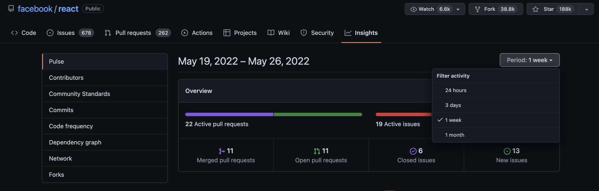
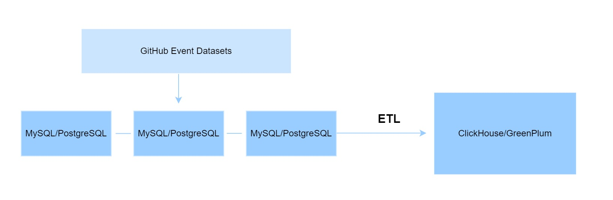
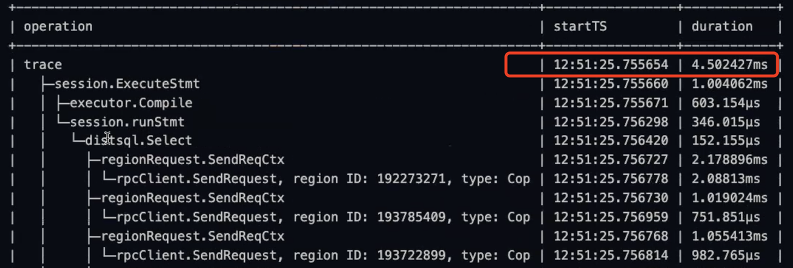
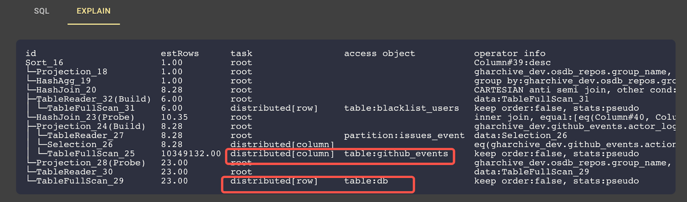
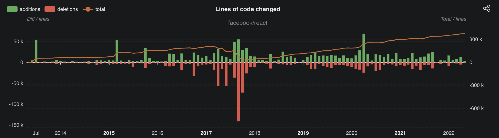
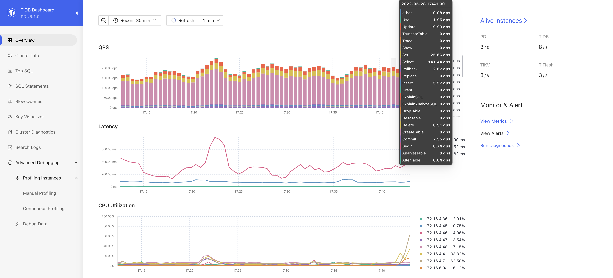
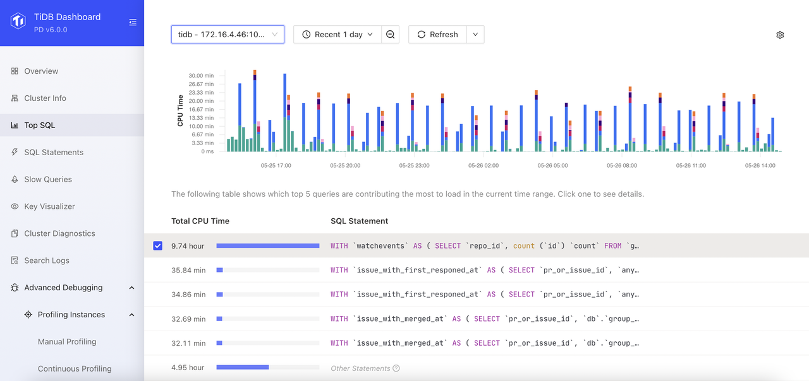
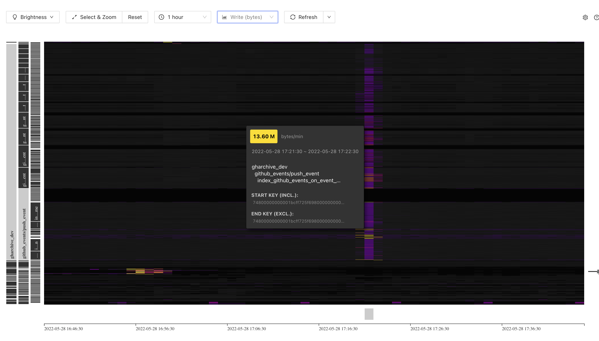

In early January 2022, Max Liu, the Co-Founder and CEO at PingCAP, asked if my team could build an insight tool to monitor and analyze all open source projects on GitHub, and prototyped it in about one week. This was a great idea, I thought, but it was not easy. 

In fact, GitHub also provides insights into each repository, but they have limitations. GitHub insights are only based on events that occurred within the past 30 days, and the analytical metrics are limited. Take Facebook’s [React repository](https://github.com/facebook/react/pulse) as an example. GitHub can only give you a rough view of repository’s contributions, commits, and code frequency, as well as a few other metrics. 

<br/>



<center><em>React repository’s insight page on GitHub</em></center>

<br />

We needed more informative, powerful, and trending open source insights. So, I decided to take up this challenge, and we made it. 

## What did we expect

What kinds of capabilities should our new insight tool have? At a minimum, it should:

- Analyze historical GitHub events which occurred during a long period of time—much longer than one month. 
- Analyze fresh GitHub events generated within the past few hours or even minutes. 
- Analyze the geographical and employment distribution of GitHub contributors and stargazers.
- Compare different repositories using the same metrics.
- Analyze open source trends and rankings. 

## Where to get the GitHub event data 

As my team and I started to think about how to build this tool, our first question was: Where do we get all the GitHub events data?

After some research, we decided to use [GHArchive](https://www.gharchive.org/) as our data source. This is an open source project that collects and archives all GitHub data that occurred from 2011 onward and updates hourly. 

Hourly data is good, but not good enough. We wanted our data to be updated in real time—or at least near real time. Then, we found the [GitHub event API](https://docs.github.com/en/rest/activity/events), which collects all events that occurred within the past hour. 

Combining the data from the GHArchive and the GitHub event API, we can gain streaming, real-time event updates. 

## Large data volume: over 4.6 billion rows of data 

After decompressing all the data we got from GHArchive, we found there were more than 4.6 billion rows of GitHub events. We also noticed that about 100,000 rows were generated and updated each hour. That’s a lot of data! 

<br/>


<center><em>The data volume of GitHub events occurred after 2011</em></center>


## What database should we use? 

Having over 4.6 billion rows of data at hand, we were faced with the second question: **What database should we use to power the processing and analytics of those events?**

### Standalone databases? No. 

With billions of rows of data to analyze, we ruled out standalone databases. Can you imagine what it would be like to have 4.6 billion rows of data in a single MySQL table?

But don’t get me wrong. I am not saying that standalone databases can’t handle that much data. In fact, we can work out a compromise solution: 

1. Divide the data into multiple database shards by the repository id.
2. Replicate a copy to a massively parallel processing (MPP) database such as ClickHouse or GreenPlum through extract, transform, load (ETL).
3. Use MySQL or PostgreSQL to respond to queries about any single GitHub repository. 
4. Use ClickHouse or GreenPlum to handle queries of complex statements. 

<br/>



<center><em>How a standalone database could handle large data volumes</em></center>

<br/>

To analyze any single repository, this architecture seems feasible, right? But, what if we want insights into individual contributors, say, the total number of their pull requests, stars, and issues? For example, if we run this SQL statement `select count(*) from github_events where actor_login = 'siddontang';`, is the architecture above agile enough? 

The answer is no. If we split the data by the repository id, the database clusters on the left side of the architecture cannot quickly respond to the above query. 

What if we use [ClickHouse](https://play.clickhouse.com/play?user=play) on the right side of the above architecture to run the same SQL statement `select count(*) from github_events where actor_login = 'siddontang';` ? We get the following result:

<br/>


<center><em>ClickHouse scanned over 4.6 billion rows of data in almost two seconds</em></center>

<br/>

ClickHouse took 1.9 seconds to scan all the 4.6 billion rows of data. Of course, ClickHouse can't handle concurrent online queries at this level, because tens of thousands of people may be making queries at the same time. You can't expect millisecond-level return speed under such concurrency.

### TiDB: a highly scalable distributed database 

After we ruled out standalone databases, we turned to TiDB, a highly scalable distributed database with Hybrid Transactional/Analytical Processing (HTAP) capability. 

Before I go into details, let’s see how long TiDB took to execute the same SQL command: `select count(*) from github_events where actor_login = 'siddontang';`.

**The answer is 4.5 ms. That’s more than 400 times faster than ClickHouse.**


<br/>



<center><em>TiDB scanned 4.6 billion rows of data in 4.5 ms</em></center>

<br/>


TiDB is very agile in processing such queries and can handle highly concurrent queries in similar scenarios. **We decided to use TiDB to power our insight tool, and of course, it did a great job.**

After we selected the database, we started to build our insight tool, which we eventually named OSSInsight, short for open source software insights. We prototyped it in just one week and then continued to fine-tune it. Finally, after a few months of hard work, we made OSSInsight into the tool it is today.

## How TiDB supports OSSInsight 

To show you how TiDB has helped us generate insights, let's take a look at a few examples in development. 

### Analyze all open source databases 

Let's use OSSInsight to analyze which open source database has the most issue creators. This is an analytical query that includes aggregation and ranking. 

To get the result, we only execute one SQL statement shown below: 

```
SELECT
   /*+ read_from_storage(tiflash[github_events]) */
   db.group_name  AS repo_group_name,
   COUNT(distinct actor_login) AS num
FROM
   github_events github_events
   JOIN osdb_repos db ON db.id = github_events.repo_id
WHERE
   type = 'IssuesEvent'
   and action = 'opened'
   -- Exclude Bots
   and actor_login not like '%bot%'
   and actor_login not in (select login from blacklist_users)
GROUP BY 1
ORDER BY 2 DESC
```

The `osdb_repos` table shown in the above SQL statement stores the data of all open source database repositories and has 23 rows.

```

mysql> select * from osdb_repos;

+-----------+-------------------------+---------------+
| id        | name                    | group_name    |
+-----------+-------------------------+---------------+
| 507775    | elastic/elasticsearch   | elasticsearch |
| 41986369  | pingcap/tidb            | tidb          |
| 16563587  | cockroachdb/cockroach   | cockroachdb   |
| 60246359  | clickhouse/clickhouse   | clickhouse    |
| 108110    | mongodb/mongo           | mongodb       |
| 11008207  | vitessio/vitess         | vitess        |
| 6358188   | apache/druid            | druid         |
...
23 rows in set (0.05 sec)

```

To get the order of issue creators, we need to associate the repository id in `osdb_repos` with the real, 4.6-billion-row `github_events` table. It doesn’t look anything special, does it?

Next, let's take a look at the execution plan.TiDB is compatible with MySQL syntax, so its execution plan structure looks very similar to that of MySQL.

In the figure below, notice the parts in red boxes. The data in the table `db`, the alias of `osdb_repos` table, is read through `distributed[row]`, which means this data is processed by TiDB’s row storage engine—TiKV;  and the data in the table `github_events` is read through `distributed[column]`, which means this data is processed by TiDB’s columnar storage engine—TiFlash. TiDB uses both row and columnar storage engines to execute the same SQL statement. 

<br/>



<center><em>TiDB execution plan</em></center>

<br/>


This is so convenient for OSSInsight because it doesn’t have to split the query into two statements. 
The results returned by TiDB are as follows: 

```

+-----------------+------+
| repo_group_name | num  |
+-----------------+------+
| elasticsearch   | 8218 |
| clickhouse      | 3269 |
| tidb            | 1628 |
| cockroachdb     | 1355 |
| druid           | 1234 |
| trino           | 878  |
| yugabytedb      | 696  |
| doris           | 616  |
| gpdb            | 609  |
| vitess          | 457  |
| citus           | 279  |
| foundationdb    | 249  |
| starrocks       | 229  |
| oceanbase       | 153  |
+-----------------+------+
14 rows in set
Time: 7.809s

``` 

Then, we just need to draw the results into [a more visualized chart](https://ossinsight.io/blog/deep-insight-into-open-source-databases/#which-databases-have-the-widest-feedback-sources) as shown below. 

<br/>


<center><em>Top open source databases with the most issue creators</em></center>


### Analyze a single repository 

OSSInsight needs to do a lot more than just rank certain aspects of a project. It should be able to analyze a project in depth. To make this happen, we were faced with at least three major challenges: 
There were over 200 million repositories with over 4.6 billion rows of data. 

We needed to display repository details in many dimensions such as company and individual contributors, code changes, and contribution history. 

We had to support highly concurrent queries because user behavior is arbitrary, and there is no way to cache data. 

TiDB’s rowstore index helped us overcome these challenges. 

Take [facebook/react](https://github.com/facebook/react/pulse) as an example. Let’s analyze its code changes since its inception. To get the result, we used the following SQL statement: 

 ``` 
select
   event_month,
   sum(additions) as additions,
   sum(deletions) as deletions,
   sum(additions) - sum(deletions) as net_additions,
   sum(additions) + sum(deletions) as changes
from github_events
use index(index_github_events_on_repo_id)
where
   repo_id = 10270250
   and type = 'PullRequestEvent'
   and action = 'closed'
   and pr_merged = true
group by event_month
order by event_month
;

```

This statement includes a `use index` command: `use index(index_github_events_on_repo_id)`. This is TiDB’s rowstore index, which will be read and processed by TiKV. TiDB ran this statement in 0.13 s. 

The figure below is [the result](https://ossinsight.io/analyze/facebook/react/) generated by OSSInsight with the help of TiDB. 

<br/>



<center><em>Code changes of facebook/react repository</em></center>

<br/>

Note: You can click the `REQUEST INFO ` on the upper right side of each chart to get the SQL commands for each result. 

### Observability in TiDB

TiDB is great in observability, which speeded up the iterative process of OSSInsight.

Typically, almost half of the application development time is devoted to testing and debugging. TiDB makes this process more visible, so you can easily find bugs and correct them as quickly as possible. 
TiDB Dashboard can help you “observe” many performance indicators such as data traffic, workloads, and hotspots. 

The following figure shows the TiDB Dashboard. You can see that there has been an average of about 150 queries per second (QPS) in the most recent 30 minutes, and the latency has been very short. 

<br/>



<center><em>TiDB Dashboard</em></center>

<br/>

The SQL statements used in OSSInsight include both real-time querying and analytical syntax. Usually, when you test complex analytical statements, you often encounter slow queries, but it is very difficult to find the real culprit by looking at the database's slow query log. When the whole system has slowed down, it becomes even harder to find the cause because normal statements will also appear in the slow query log. 

TiDB can make this easier. When we find the execution of SQL statements is slower than expected, we will activate TiDB’s Top SQL feature. Contrary to slow query, it calculates the real CPU usage time of each statement and sorts the results according to time consumption. It does not count CPU waiting time due to a heavy system workload. As a result, the real slow query is easy to spot. 

<br/>



<center><em>TiDB Dashboard</em></center>

<br/>

TiDB’s Key Visualizer is also my favorite. 

<br/>



<center><em>TiDB’s Key Visualizer</em></center>

<br/>

As shown in the figure above, the brighter the color, the greater the write and read traffic. We can use the brightness of the color to quickly spot the read or write hotspots in the database, and make adjustments accordingly in time. 

## Summary 

There are many reasons why we chose TiDB to support OSSInsight. Among the major reasons, TiDB:
Is compatible with MySQL.

- Has both the transactional and analytical engines to support transaction-level detailed queries and real-time analytics at a low cost.
- Can easily scale out to support rising data volume without refactoring the database architecture.
- Is strongly observable to enable quick testing and debugging. 