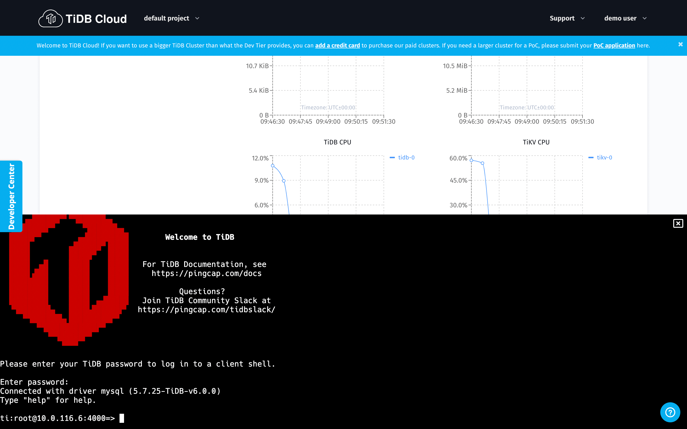

[TiDB](https://docs.pingcap.com/tidb/stable/overview?utm_source=ossinsight&utm_medium=referral) is an open source distributed NewSQL database with horizontal scalability, high availability, and strong consistency. It can also deal with mixed OLTP and OLAP workloads at the same time by leveraging its hybrid transactional and analytical (HTAP) capability. 

**[TiDB Cloud](https://docs.pingcap.com/tidbcloud/public-preview?utm_source=ossinsight&utm_medium=referral) is a fully-managed Database-as-a-Service (DBaaS)** that brings everything great about TiDB to your cloud and lets you focus on your applications, not the complexities of your database. 

In this tutorial, we will provide you with a piece of sample data of all GitHub events occurring on January 1, 2022, and walk you through on how to use TiDB Cloud to analyze this data in 10 minutes.  

## Sign up for a TiDB Cloud account (Free)

1. Click [here](https://tidbcloud.com/free-trial/?utm_source=ossinsight&utm_medium=community) to sign up for a TiDB Cloud account free of charge. 
2. [Log in](https://tidbcloud.com/?utm_source=ossinsight&utm_medium=community) to your account.

<!--truncate-->

## Create a TiDB Cloud Serverless Tier cluster
Once you register an account, you can create a cluster with TiDB Cloud Serverless Tier. 

:::info
 A cluster is a database to store data. 
:::

1. Click **Get Started for Free** and start to create a cluster.


2. On the **Create a Cluster** page, set up your cluster name and root password.
3. Note that the cloud provider is AWS by default, and then **MUST** select the `US-West-2 (Oregon)` region to create the cluster.
4. The cluster tier is S1.dev by default.
5. Click **Submit**.
Your TiDB Cloud cluster will be created in approximately 1 to 3 minutes.


## Import data to your TiDB Cloud cluster

### Import the data
Once your cluster is ready, you can start to import the sample data to your cluster. 

:::info
We have merged the create database/table in the SQL files, so you don't need to `create database/tables` by yourself.

If you want to know the table schema, you can check `desc gharchive_dev` later in the following step. 
:::

1. Click your cluster name in **Active Cluster** page to get into the detail page of your cluster.
2. Click the **Import** button on the **Active Clusters** page and then go to the **Data Import Task** page. 


3. Copy the values below and paste to the blanks of **Bucket URL** and **Role-ARN** respectively on the **Data Import Task** page.

**Bucket URL**:
```
s3://tidbcloud-samples/gharchive/
```
**Role-ARN**:
```
arn:aws:iam::385595570414:role/import-sample-access
```

4. Choose **US West (Oregon)** for your **Bucket region**;
5. Tick **TiDB Dumpling** for the **Data Format**. 
6. Input your cluster password in the blank of **Password** on the **Target Database** section. 


7. After you fill in all the blanks on the **Data Import Task** page, click the **Import** button at the bottom of this page and wait for a few moments for the system to complete data importing. 


### Use the web shell to check if data is ready
TiDB Cloud provides a web shell to connect the database online. 
1. Click the **Exit** button after you successfully import the data into your cluster. 
2. Click your cluster name in **Active Cluster** page to get into the detail page of your cluster.
3. Then, click the **Connect** button and the **Connect to TiDB** panel pops out. 
4. Choose **Web SQL Shell** --> **Open SQL Shell**. 
5. Then input your cluster password as shown in the image below.




### Set column storage replica: TiFlash (Optional but could make SQL faster!) 

[TiFlash](https://docs.pingcap.com/tidb/stable/tiflash-overview?utm_source=ossinsight&utm_medium=referral) is the key component that makes TiDB / TiDB Cloud an HTAP database and capable of dealing with OLTP and OLAP workloads at the same time. 

Here, you can try the following SQL commands on TiDB Cloud to experience its real-time analytics with ease.

1. Execute the SQL statements specified below 

```sql
use gharchive_dev;
ALTER TABLE github_events SET TIFLASH REPLICA 1;
```

2. Setting a TiFlash replica will take you some time, so you can use the following SQL statements to check if the procedure is done or not. 

```sql
SELECT * FROM information_schema.tiflash_replica WHERE TABLE_SCHEMA = 'gharchive_dev' and TABLE_NAME = 'github_events';
```

If the results you get are the same as follows, then it means the procedure is done. 

```sql
mysql> SELECT * FROM information_schema.tiflash_replica WHERE TABLE_SCHEMA = 'gharchive_dev' and TABLE_NAME = 'github_events';
+---------------+---------------+----------+---------------+-----------------+-----------+----------+
| TABLE_SCHEMA  | TABLE_NAME    | TABLE_ID | REPLICA_COUNT | LOCATION_LABELS | AVAILABLE | PROGRESS |
+---------------+---------------+----------+---------------+-----------------+-----------+----------+
| gharchive_dev | github_events |       68 |             1 |                 |         1 |        1 |
+---------------+---------------+----------+---------------+-----------------+-----------+----------+
1 row in set (0.27 sec)

mysql>
```

## Analysis!

After you finish all the steps above, you can start the analytical process. 

:::tip
If you want to know the table schema, you can use `show create table tbl_name` to get that information.
:::

Because you have imported the sample data of all GitHub events occurred on the first hour of 2022 (from 2022-01-01 00:00:00 to 2022-01-01 00:59:59), you can start to make any queries based on that data by using SQL commands. 

### How many events occurred in total?
Execute the following SQL statement to query the total number of events. 

```sql
SELECT count(*) FROM github_events;
```

### Which repository gets the most stars?
Execute the following statements to query the most starred repository. 

```sql
  SELECT repo_name, count(*) AS events_count
    FROM github_events
   WHERE type = 'WatchEvent' /* Yes, `WatchEvent` means star */
GROUP BY 1
ORDER BY 2 DESC
   LIMIT 20;
```


## Mini Test
Here is a small test for you to practice how to use TiDB Cloud to conduct analytics. 

### Q: Who is the most active contributor except the robot accounts on the first hour of 2022?

### Click for the answer. ⬇️

<details><summary>Click me to show answer</summary>

```sql
  SELECT actor_login, 
         count(*) AS events_count
    FROM github_events
   WHERE actor_login NOT LIKE '%bot%'
GROUP BY 1
ORDER BY 2 DESC 
   LIMIT 20;
```

</details>

:::info
### 🌟 Details in how OSS Insight works

Find the reason [How we implement OSS Insight ?](/blog/why-we-choose-tidb-to-support-ossinsight).

You can find how we deal with massive github data in [Data Preparation for Analytics](/blog/how-it-works) as well!
:::
