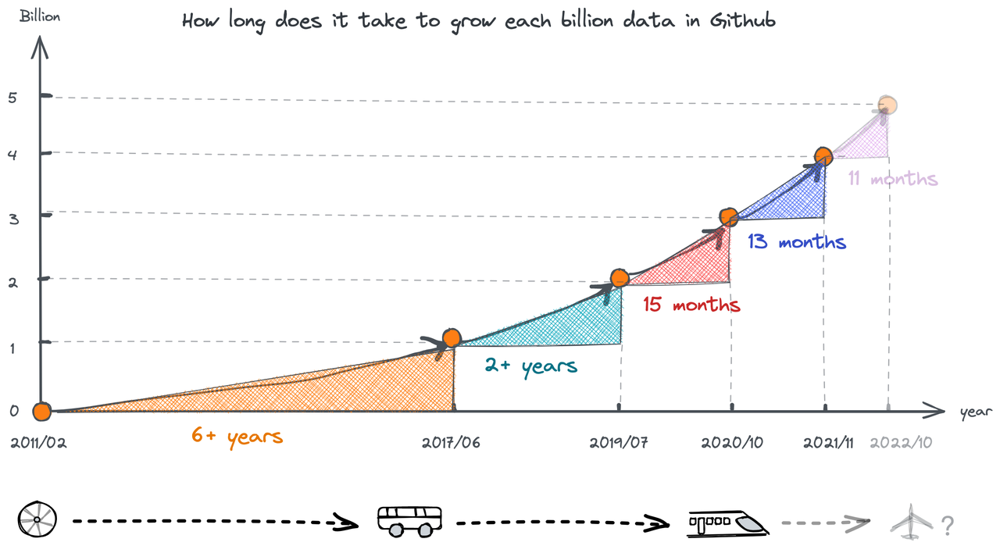
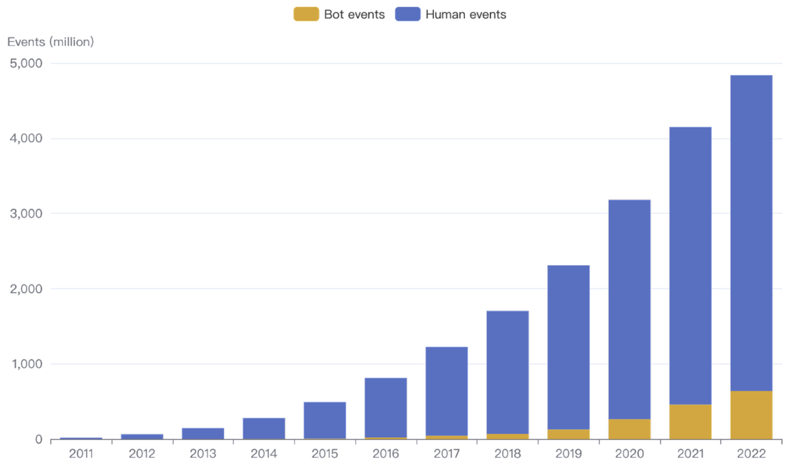
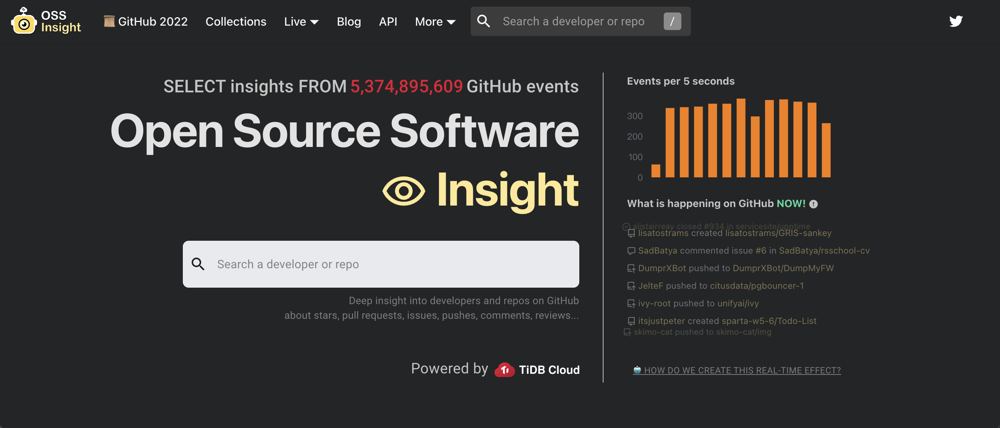

The [OSS Insight](https://ossinsight.io/) website displays the data changes of GitHub events in real time. GitHub events are activities triggered by user actions on GitHub, for example, commenting and forking a repository. **In nearly seven weeks, GitHub events increased by about 150 million, from 4.7 billion to 4.85 billion.** GitHub events are booming!

This post dives deeply into GitHub event trending, why GitHub events are surging, and whether GitHub's architecture can handle the increasing load.

## Historical data analysis

The OSS Insight database includes all the GitHub events since 2011. When we plot the number of events by year, we can see that since 2018 they have been increasing rapidly.

 

<em>GitHub event trending</em>

 

The figure below shows how long it takes to grow each billion events in GitHub.

 

<em>The time to reach a billion GitHub events</em>

 

**It's taking less and less for GitHub to generate 1 billion events. It took more than 6 years for the first billion events and only 13 months for the last billion!**

## The secret behind the exponential growth of GitHub events

[GitHub Actions](https://github.blog/2018-10-16-future-of-software/) was released in October 2018. Since August 2019, it has [supported continuous integration and continuous delivery (CI/CD)](https://github.blog/2019-08-08-github-actions-now-supports-ci-cd/), and it has been free for open source projects. Therefore, projects hosted on GitHub can automate their own development workflows, and a large number of automation-related bot applications have appeared on GitHub Marketplace. Could GitHub events' data growth be related to these?

To find the answer, we divided the events into data from humans and data from bots and plotted them with the following histogram. The blue columns represent the human data, and the yellow columns represent the bot data.

 

<em>Bot events vs. human events</em>

 

As you can see, the proportion of GitHub bot events has increased each year. In 2015, they were only 1.23% of all events. In early July of this year, they reached 13.2%. To show the data changes of bot events more clearly, we made the following line chart.

 

<em>Bot event trending</em>

 

This figure shows that since 2019, bot events have been grown faster than before. As [Mini256](https://github.com/Mini256), a TiDB community contributor said in [Love, Code, and Robot — Explore robots in the world of code](https://ossinsight.io/blog/say-thanks-to-github-robots):

> For now, rough statistics find that there are more than 95,620 bots on GitHub. The number doesn't seem like so much, but wait...

> **These 95 thousand bot accounts generated 603 million events. These events account for 12.82% of all public events on GitHub**, and these GitHub robots have served over 18 million open source repositories.

Bots are playing an increasingly important role on GitHub. Many projects are handing over automated work to bots. We expect that GitHub events will grow faster in the future.

## When will GitHub reach 10 billion events?

How many GitHub events will there be by the end of 2022? We fit predictions to GitHub historical data.

 

<em>Human event fit (left) vs. bot event fit (right)</em>

 

It's estimated that by the end of 2022, GitHub events will reach 5.36 billion.

 

<em>GitHub event prediction</em>

 

According to this prediction, GitHub events will exceed 10 billion in February 2025.

 

<em>GitHub events will exceed 10 billion in 2025</em>

 

## Can MySQL sharding support such a huge amount of data?

GitHub uses MySQL as the main storage for all non-git warehouse data. The rapid growth of data volume poses a great challenge to GitHub's high availability. In March 2022, GitHub had 3 service disruptions, each lasting 2-5 hours. [The official investigation report](https://github.blog/2022-03-23-an-update-on-recent-service-disruptions/) shows the MySQL database caused the outages. During peak load periods, the GitHub mysql1 database (the main database cluster in GitHub) load increased. Therefore, database access reached the maximum number of connections. This affected the performance of many GitHub services and features.

In fact, over the past few years GitHub has optimized its databases. For example, it added clusters to support platform growth and partitioned the main database. But these improvements did not fundamentally solve the problem. In the near future, GitHub events will exceed 5 billion, or even 10 billion. Can MySQL sharding support such data surge?

## Data sources

All the analysis data in this article comes from [OSS Insight](https://ossinsight.io/), a tool based on [TiDB]( https://en.pingcap.com/tidb-cloud/?utm_source=ossinsight&utm_medium=referral) to analyze and gain insights into GitHub events data.

You can use it to easily get insights about developers and repositories based on billions of GitHub events. You can also get the latest and historical rankings and trends in technical fields.

 

<em>The OSS Insight website</em>

 
