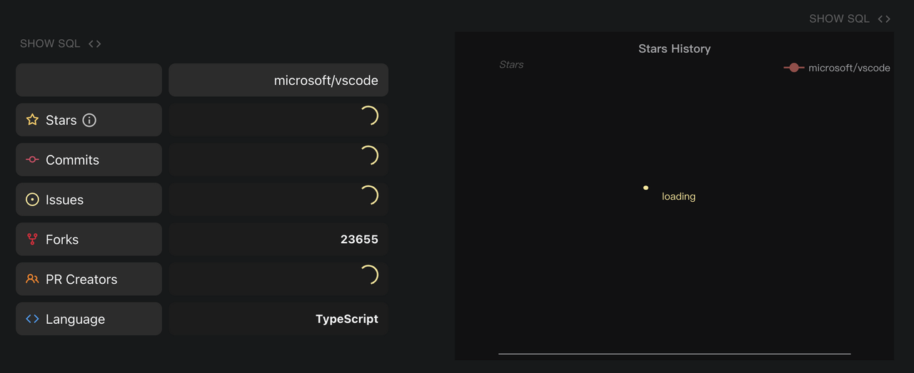
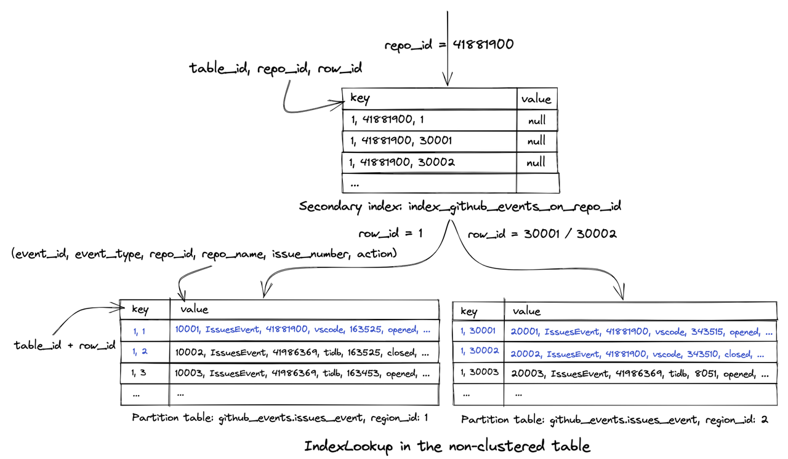
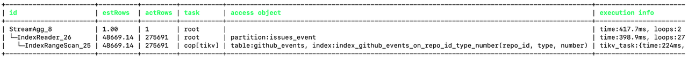

**_TL;DR:_**

_This post tells how a website on a distributed database **reduced online serving latency from 1.11 s to 417.7 ms, and then to 123.6 ms**. We found that some lessons learned on MySQL could be applied throughout the optimization process. But when we optimize a **distributed database,** we need to consider more._

The [OSS Insight](https://ossinsight.io/) website displays the data changes of GitHub events in real time. It's powered by [TiDB Cloud](https://www.pingcap.com/tidb-cloud/), a MySQL-compatible distributed SQL database for elastic scale and real-time analytics.

Recently, to save costs, we tried to use lower-specification machines without affecting query efficiency and user experience. But our website and query response slowed down.

<br />



<center><em>The repository analysis page was loading, loading, and loading</em></center>

<br />

How could we solve these problems on a distributed database? Could we use the methodology we learned on MySQL?

## Analyzing the SQL execution plan

To identify slow SQL statements, we used TiDB Cloud's Diagnosis page to sort SQL queries by their average latency.

For example, after the API server received a request, it executed the following SQL statement to obtain the number of issues in the [vscode repository](https://ossinsight.io/analyze/microsoft/vscode):

```sql
SELECT
    COUNT(DISTINCT number)
FROM github_events
WHERE
    repo_id = 41881900     -- vscode
    AND type = 'IssuesEvent';
```

However, if the open source repository is large, this query may take several seconds or more to execute.

### Using `EXPLAIN ANALYZE` to troubleshoot query performance problems

In MySQL, when we troubleshoot query performance problems, we usually use the `EXPLAIN ANALYZE <sql>` statement to view the SQL statement's execution plan. We can use the execution plan to locate the problem. The same works for TiDB.

We executed the `EXPLAIN` statement:

```sql
EXPLAIN ANALYZE SELECT
    COUNT(DISTINCT number)
FROM github_events
WHERE
    repo_id = 41881900     -- vscode
    AND type = 'IssuesEvent';
```

The result showed that the query took 1.11 seconds to execute.

<br />


<center><em>The query result</em></center>

<br />

You can see that TiDB's [`EXPLAIN ANALYZE`](https://docs.pingcap.com/tidb/stable/explain-overview) statement execution result was completely different from MySQL's. TiDB's execution plan gave us a clearer understanding of how this SQL statement was executed.

The execution plan shows:

* This SQL statement was split into several subtasks. Some were on the `root` node, and others were on the [`tikv`](https://docs.pingcap.com/tidb/dev/tikv-overview#tikv-overview) node.
* The query fetched data from the `partition:issue_event partition` table.
* This query did a range scan through the index `index_github_events_on_repo_id(repo_id)`. This let the query **narrow down the data scan quickly**. **This process only took** **59 ms.** It was the sum of the execution times of multiple concurrent tasks.
* Besides `IndexRangeScan`, **the query also used `TableRowIDScan`**. **This scan took** **4.69 s**, the sum of execution times for multiple concurrent subtasks.

From the execution times above, we determined that the query performance bottleneck was in the `TableRowIDScan` step.

We reran the `EXPLAIN ANALYZE` statement and found that the query was faster the second time. Why?

### Why did `TableRowIDScan` take so long?

To find the reason why `TableRowIDScan` took so long, we need basic knowledge of TiDB's underlying storage.

In TiDB, a table's data entries and indexes are stored on TiKV nodes in key-value pairs.

* For an index, the key is the combination of the index value and the `row_id` (for a non-clustered index) or the primary key (for a clustered index). The `row_id` or primary key indicates where the data is stored.
* For a data entry, the key is the combination of the table ID and the `row_id` or primary key. The value part is the combination of this row of data.

This graph shows how `IndexLookup` is executed in the execution plan:

<br />



<center><em>This is the logical structure, not the physical storage structure.</em></center>

<br />

In the query above, TiDB uses the query condition `repo_id=41881900` to filter out all row numbers `row_id` related to the repository in the secondary index `index_github_events_on_repo_id`. The query needs the number `column` data, but the secondary index doesn't provide it. Therefore, TiDB must execute `IndexLookup` to find the corresponding row in the table based on the obtained `row_id` (the `TableRowIDScan` step).

The rows are probably scattered in different data blocks and stored on the hard disk. This causes TiDB to perform a large number of I/O operations to read data from different data blocks or even different machine nodes.

### Why was `EXPLAIN ANALYZE` faster the second time?

In `EXPLAIN ANALYZE`'s execution result, we saw that the "execution info" column corresponding to the `TableRowIDScan` step contained this information:

```
block: {cache_hit_count: 2755559, read_count: 179510, read_byte: 4.07 GB}
```

We thought this had something to do with TiKV. TiKV read a very large number of data blocks from the disk. Because the data blocks read from the _disk_ were cached in _memory_ in the first execution, 2.75 million data blocks could be read directly from _memory_ instead of being retrieved from the hard disk. This made the `TableRowIDScan` step much faster, and the query was faster overall.

However, we believed that user queries were random. For example, a user might look up data from a `vscode` repository and then go to a `kubernetes` repository. TiKV's memory couldn't cache all the data blocks in all the drives. Therefore, this did not solve our problem, but it reminded us that when we analyze SQL execution efficiency, we need to exclude cache effects.

## Using a covering index to avoid executing `TableRowIDScan`

Could we avoid executing `TableRowIDScan` in `IndexLookup`?

In MySQL, a covering index prevents the database from index lookup after index filtering. We wanted to apply this to OSS Insight. In our TiDB database, we tried to create a composite index to achieve index coverage.

When we created a composite index with multiple columns, we needed to pay attention to the column order. Our goals were to allow a composite index to be used by as many queries as possible, to help these queries narrow the scope of data scans as quickly as possible, and to provide as many fields as possible in the query. When we created a composite index we followed this order:

1. Columns that had high differentiation and could be used as equivalence conditions for the `WHERE` statement, like `repo_id`
2. Columns that didn't have high differentiation but could be used as equivalence conditions for the `WHERE` statement, like `type` and `action`
3. Columns that could be used as range query conditions for the `WHERE` statement, like `created_at`
4. Redundant columns that were not used as filter conditions but were used in the query, such as `number` and `push_size`

We used the `CREATE INDEX` statement to create a composite index in the database:

```
CREATE INDEX index_github_events_on_repo_id_type_number ON github_events(repo_id, type, number);
```

When we created the index and ran the SQL statement again, the query speed was significantly faster. We viewed the execution plan through `EXPLAIN ANALYZE` and found that the execution plan became simpler. The `IndexLookup` and `TableRowIDScan` steps were gone. **The query took only 417.7 ms**.

<br />



<center><em>The result of the EXPLAIN query. This query cost 417.7 ms</em></center>

<br />

So we knew that our query could get all the data it needed by doing an `IndexRangeScan` on the new index. This composite index included the `number` field, so TiDB did not need to perform `IndexLookup` to get data from the table. This reduced a lot of I/O operations.

<br />


<center><em>IndexRangeScan in the non-clustered table</em></center>

<br />

## Pushing down computing to further reduce query latency

For a query that needed to obtain 270,000 rows of data, 417.7 ms was quite a short execution time. But could we improve the time even more?

We thought this relied on TiDB's architecture that separates computing and storage layers. This is different from MySQL.

In TiDB:

* The `tidb-server` node computes data. It corresponds to root in the execution plan.
* The `tikv-server` node stores the data. It corresponds to `cop[tikv]` in the execution plan.

Generally, an SQL statement is split into multiple steps to execute with the cooperation of computing and storage nodes.

When we executed the SQL statement in this article, TiDB obtained the data of the `github_events` table from `tikv-server` and performed the aggregate calculation of the COUNT function on `tidb-server`.

```sql
SELECT
    COUNT(DISTINCT number)
FROM github_events
WHERE
    repo_id = 41881900     -- vscode
    AND type = 'IssuesEvent';
```

The execution plan indicated that when TiDB was performing `IndexReader`, `tidb-server` needed to read 270,000 rows of data from `tikv-server` through the network. This was time-consuming.

<br />


<center><em>tidb-server read 270,000 rows of data from tikv-server</em></center>

<br />

How could we avoid such a large network transmission? Although the query needed to obtain a large amount of data, the final calculation result was only a number. Could we complete the `COUNT` aggregation calculation on `tikv-server` and return the result only to `tidb-server`?

TiDB had implemented this idea through the [coprocessor](https://docs.pingcap.com/tidb/dev/tikv-overview#tikv-coprocessor) on `tikv-server`. This optimization process is called computing pushdown.

The execution plan indicated that our SQL query did not do this. Why? We checked the TiDB documentation and learned that:

> Usually, aggregate functions with the `DISTINCT` option are executed in the TiDB layer in a single-threaded execution model.

This meant that our SQL statement couldn't use computing pushdown.

```sql
SELECT
    COUNT(DISTINCT number)
FROM github_events
WHERE
    repo_id = 41881900     -- vscode
    AND type = 'IssuesEvent';
```

Therefore, we removed the `DISTINCT` keyword.

For the `github_events` table, an issue only generated an event with the `IssuesEvent` type and `opened` action. We could get the total number of unique issues by adding the condition of `action = 'opened'`. This way, we didn't need to use the `DISTINCT` keyword for deduplication.

```
SELECT
    COUNT(number)
FROM github_events
WHERE
    repo_id = 41881900     -- vscode
    AND type = 'IssuesEvent'
    AND action = 'opened';
```

The composite index we created lacked the `action` column. This caused the query index coverage to fail. So we created a new composite index:

```
CREATE INDEX index_github_events_on_repo_id_type_action_number ON github_events(repo_id, type, action, number);
```

After we created the index, we checked the execution plan of the modified SQL statement through the `EXPLAIN ANALYZE` statement. We found that:

* Because we added a new filter `action='opened'`, the number of rows to scan had decreased from 270,000 to 140,000.
* `tikv-server` executed the `StreamAgg` operator, which was the aggregate calculation of the `COUNT` function. This indicated that the calculation had been pushed down to the TiKV coprocessor for execution.
* `tidb-server` only needed to obtain two rows of data from `tikv-server` through the network. This greatly reduced the amount of data transmitted.
* The query only took 123.6 ms.

```
+-------------------------+---------+---------+-----------+-------------------------------------------------------------------------------------------------------------------------+--------------------------------------------------------------------------------------------------------------------------------------------------------------------------------------------------------------------------------------------------------------------------------------------------------------------------------------------------------------------------+-------------------------------------------------------------------------------------------+-----------+------+
| id                      | estRows | actRows | task      | access object                                                                                                           | execution info                                                                                                                                                                                                                                                                                                                                                           | operator info                                                                             | memory    | disk |
+-------------------------+---------+---------+-----------+-------------------------------------------------------------------------------------------------------------------------+--------------------------------------------------------------------------------------------------------------------------------------------------------------------------------------------------------------------------------------------------------------------------------------------------------------------------------------------------------------------------+-------------------------------------------------------------------------------------------+-----------+------+
| StreamAgg_28            | 1.00    | 1       | root      |                                                                                                                         | time:123.6ms, loops:2                                                                                                                                                                                                                                                                                                                                                    | funcs:count(Column#43)->Column#34                                                         | 388 Bytes | N/A  |
| └─IndexReader_29        | 1.00    | 2       | root      | partition:issues_event                                                                                                  | time:123.6ms, loops:2, cop_task: {num: 2, max: 123.5ms, min: 1.5ms, avg: 62.5ms, p95: 123.5ms, max_proc_keys: 131360, p95_proc_keys: 131360, tot_proc: 115ms, tot_wait: 1ms, rpc_num: 2, rpc_time: 125ms, copr_cache_hit_ratio: 0.50, distsql_concurrency: 15}                                                                                                           | index:StreamAgg_11                                                                        | 590 Bytes | N/A  |
|   └─StreamAgg_11        | 1.00    | 2       | cop[tikv] |                                                                                                                         | tikv_task:{proc max:116ms, min:8ms, avg: 62ms, p80:116ms, p95:116ms, iters:139, tasks:2}, scan_detail: {total_process_keys: 131360, total_process_keys_size: 23603556, total_keys: 131564, get_snapshot_time: 1ms, rocksdb: {delete_skipped_count: 320, key_skipped_count: 131883, block: {cache_hit_count: 307, read_count: 1, read_byte: 63.9 KB, read_time: 60.2µs}}} | funcs:count(gharchive_dev.github_events.number)->Column#43                                | N/A       | N/A  |
|     └─IndexRangeScan_15 | 7.00    | 141179  | cop[tikv] | table:github_events, index:index_ge_on_repo_id_type_action_created_at_number(repo_id, type, action, created_at, number) | tikv_task:{proc max:116ms, min:8ms, avg: 62ms, p80:116ms, p95:116ms, iters:139, tasks:2}                                                                                                                                                                                                                                                                                 | range:[41881900 "IssuesEvent" "opened",41881900 "IssuesEvent" "opened"], keep order:false | N/A       | N/A  |
+-------------------------+---------+---------+-----------+-------------------------------------------------------------------------------------------------------------------------+--------------------------------------------------------------------------------------------------------------------------------------------------------------------------------------------------------------------------------------------------------------------------------------------------------------------------------------------------------------------------+-------------------------------------------------------------------------------------------+-----------+------+
```

## Applying what we learned to other queries

**Through our analysis and optimizations, the query latency was significantly reduced:**

**1.11 s → 417.7 ms → 123.6 ms**

We applied what we learned to other queries and created the following composite indexes in the `github_events` table:

```
index_ge_on_repo_id_type_action_pr_merged_created_at_add_del

index_ge_on_repo_id_type_action_created_at_number_pdsize_psize

index_ge_on_repo_id_type_action_created_at_actor_login

index_ge_on_creator_id_type_action_merged_created_at_add_del

index_ge_on_actor_id_type_action_created_at_repo_id_commits
```

These composite indexes covered more than 20 analytical queries in repository analysis and personal analysis pages on the OSS Insight website. This improved our website's overall loading speed.

**Some lessons we learned on MySQL can be applied throughout the optimization process.** But we need to consider more when we optimize query performance in a **distributed database**. We also recommend you read [Performance Tuning](https://docs.pingcap.com/tidb/stable/performance-tuning-overview) in the TiDB documentation. This will give you a more professional and comprehensive guide to performance optimization.

## References

* [TiDB Computing](https://docs.pingcap.com/tidb/dev/tidb-computing)
* [TiDB Storage](https://docs.pingcap.com/tidb/stable/tidb-storage)
* [Distinct Optimization](https://docs.pingcap.com/tidb/stable/agg-distinct-optimization)
