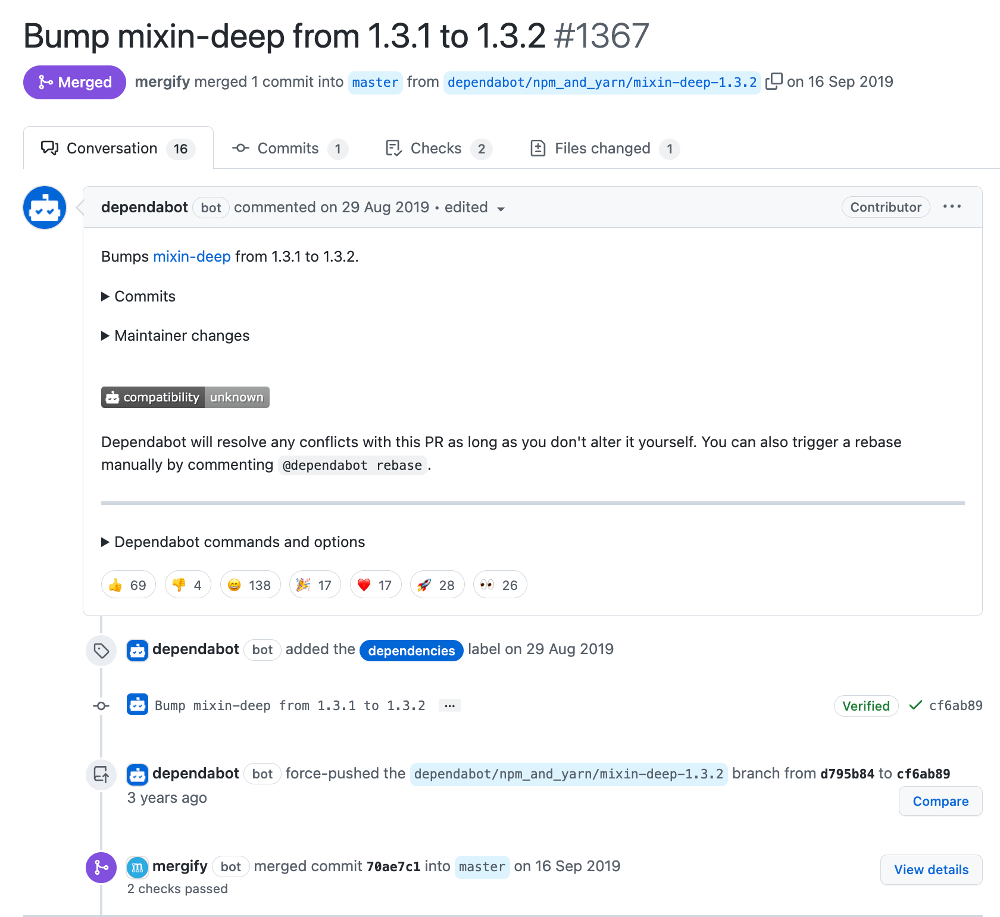
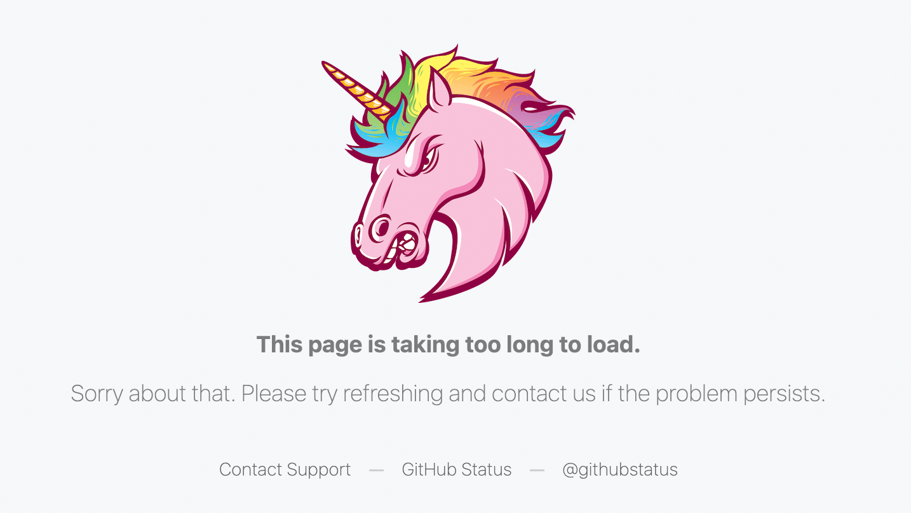

import {CommonChart} from "../../src/components/CommonChart";

# Love, Code, and Robot — Explore robots in the world of code

When it comes to GitHub, we often see fake GitHub users who are always enthusiastic and active, giving timely feedback to project maintainers and contributors, and helping developers with tasks that can be automated. Yes, the next thing I want to discuss is something about GitHub bots.

## Overview

In the [OSSInsight](https://ossinsight.io/) project, we have developed a number of metrics to provide insight into open source projects. When developing some open source project metrics, we always consider excluding bot-generated actions or events from the metric calculation. 

However, We can't ignore the contribution of robots in the domain of open source, and it's important to shift our thinking to look at what bots are doing on GitHub.

GitHub's bots help developers do a lot of work:

- Issue triage and management. (For example: `stale[bot]`、`todo[bot]`)
- Code review, security audit and quality inspection (For example, `snyk-bot`).
- Format checking like ensuring license agreement signing, or make sure  commit messages semantic. (For example: `CLAassistant`)
- Integration with third-party systems, including Jira, Slack, Jenkins and so on.
- As an agent to help contributor perform some operations needed permission on the repository. (For example: `k8s-ci-bot`、`ti-chi-bot`)

## History trends

Looking at the historical data, we see that the number of GitHub bots grows significantly faster after 2019 (on average, 20,000 new bots are created each year)

<CommonChart
  chart='dynamic-line'
  query='archive/bot/cumulative-numbers'
  formatSql={false}
  xIndex="event_year"
  yIndex="bots_total"
/>

<!--truncate-->

I looked into what happened during the year and found that GitHub invested a lot in its software development infrastructure (including bots) during the year.

- On May 23, 2019, GitHub announced acquired Dependabot (Aka, `dependabot[bot]`).

- In June 17th, 2019, [GitHub announced acquired Pull Panda](https://github.blog/2019-06-17-github-acquires-pull-panda/).

- In September 18th, 2019, [GitHub announced acquired Semmle](https://github.blog/2019-09-18-github-welcomes-semmle/) (Aka, the team built `lgtm-com[bot]`).

At this year, we, human beings, were amazed to discover that bots could find problems, submit PRs, wait CI test code, complete merges and comment on PRs on their own without any human involvement.

[](https://github.com/buildo/react-components/pull/1367)

For now, rough statistics found that there are more than 95,620 bots on GitHub, the number doesn't seem like so much, but wait...

<details>
<summary>Click here to show computational process</summary>

Before that, we had collected 4.7 billion github events stored in our database. Now we can count the number of bots on GitHub by executing a simple SQL statement:

```sql
SELECT COUNT(DISTINCT actor_login) AS 'Bots'
FROM github_events ge
WHERE actor_login REGEXP '^(bot-.+|.+bot|.+\\[bot\\]|.+-bot-.+|robot-.+|.+-ci-.+|.+-ci|.+-testing|.+clabot.+|.+-gerrit|k8s-.+|.+-machine|.+-automation|github-.+|.+-github|.+-service|.+-builds|codecov-.+|.+teamcity.+|jenkins-.+|.+-jira-.+)$';
```

In this SQL statement, we use a regular expression to determine which `actor_login` is the robot login. For example, the well known star robot `dependabot[bot]`, whose github login ends with `[bot]`, we can find more bots among a large number of events based on this method.

```
+-------+
| Bots  |
+-------+
| 95620 |
+-------+
1 row in set
Time: 16.921s
```

</details>

**👀 These 95 thousand bot accounts generated 603 million events, these events account for 12.82% of all public events on GitHub.**

<details>
<summary>Click here to show computational process</summary>

1. Count the total number of public events triggered by GitHub bot

```sql
SELECT COUNT(*) AS 'Bot''s events'
FROM github_events ge
WHERE actor_login REGEXP '^(bot-.+|.+bot|.+\\[bot\\]|.+-bot-.+|robot-.+|.+-ci-.+|.+-ci|.+-testing|.+clabot.+|.+-gerrit|k8s-.+|.+-machine|.+-automation|github-.+|.+-github|.+-service|.+-builds|codecov-.+|.+teamcity.+|jenkins-.+|.+-jira-.+)$';
```

```
+--------------+
| Bot's events |
+--------------+
| 603554237    |
+--------------+
1 row in set
Time: 13.087s
```

2. Count the total number of all public events on GitHub

```sql
SELECT COUNT(*) AS 'All public events' FROM github_events ge;
```

```
+-------------------+
| All public events |
+-------------------+
| 4705191048        |
+-------------------+
1 row in set
Time: 4.322s
```

3. Calculate the proportion of the former in the latter

```sql
SELECT CONCAT(TRUNCATE(603554237 / 4705191048 * 100, 2), '%') AS 'Proportion of Events';
```

```
+----------------------+
| Proportion of Events |
+----------------------+
| 12.82%               |
+----------------------+
1 row in set
Time: 0.047s
```


</details>

And these GitHub robots have served over 18 million open source repositories.

<details>
<summary>Click here to show computational process</summary>

```sql
SELECT COUNT(DISTINCT repo_id) AS 'Repositories'
FROM github_events ge
WHERE actor_login REGEXP '^(bot-.+|.+bot|.+\\[bot\\]|.+-bot-.+|robot-.+|.+-ci-.+|.+-ci|.+-testing|.+clabot.+|.+-gerrit|k8s-.+|.+-machine|.+-automation|github-.+|.+-github|.+-service|.+-builds|codecov-.+|.+teamcity.+|jenkins-.+|.+-jira-.+)$';
```

```
+--------------+
| Repositories |
+--------------+
| 18415262     |
+--------------+
1 row in set
Time: 27.060s
```

</details>

## Cases study

### Dependabot\[bot\]

`dependabot[bot]` is a hard-working bot responsible for helping open source projects keep their dependencies up to date.

By analyzing depentenbot's Push commit time, we found that he likes to start his busy week at 8:00 on Mondays (at GMT timezone).

<CommonChart
  chart='heatmapchart'
  category='archive/bot/dependabot-commits-time-distribution'
  xIndex='hour'
  yIndex='dayofweek'
  valueIndex='pushes'
  formatSql={false}
/>

It is commendable that, after a series of log4j security vulnerabilities came to light, it helped many Java-language repositories to update the dependency to a secure version timely.

### Stale Bots

Stale Bot is a controversial class of robots, they are responsible for reminding maintainers to continue promoting long-term stale issue.

<table>
<tr>
    <th>Bad practice</th>
    <th>Best practices</th>
</tr>
<tr>
<td>

The user from Gatsby:

> I used to open GitHub issues to Gatsby to report bugs. Almost nothing was ever fixed and every few weeks I had to manually clickety-click to keep the issues alive because of the stale bot. Guess what I do now? I don't report bugs to Gatsby, and I recommend against using Gatsby in newer projects.

</td>
<td>

The user from NixOS:

> IMO NixOS has the right stalebot settings <sub>[0]</sub>. It was discussed thoroughly in the RFC, as to choose the right information text and other actions by the bot. For example, the bot will only mark the issue/PR as stale and will never close the issue or lock it. Issues are only ever closed by humans.
The information text they came up with is quite a bit longer than the ansible one <sub>[1]</sub>. I think this is a very important point when adding such a bot, otherwise the user will be left helpless.

> [0]: https://github.com/NixOS/rfcs/pull/51

> [1]: https://github.com/NixOS/nixpkgs/pull/92254

</td>
</tr>
</table>

To verify the above statement, we run the following query through the SQL statement:

```sql
SELECT actor_login, COUNT(DISTINCT pr_or_issue_id) AS cnt
FROM github_events ge
WHERE
    repo_name = 'gatsbyjs/gatsby'
    AND type = 'IssuesEvent'
    AND action = 'closed'
    AND (actor_login LIKE '%[bot]' OR actor_login LIKE '%bot')
GROUP BY actor_login
ORDER BY cnt DESC;
```

We know from the following query that many Issues in the `gatsbyjs/gatsby` repository have been closed by the stale bots.

```
+---------------------+------+
| actor_login         | cnt  |
+---------------------+------+
| gatsbot[bot]        | 1389 |
| github-actions[bot] | 777  |
| gatsbybot           | 265  |
| stale[bot]          | 50   |
| renovate[bot]       | 1    |
+---------------------+------+
5 rows in set
Time: 0.100s
```

I think it is necessary to distinguish between what should be done by robots and what must be done with human involvement.

### Weird bots

There are some weird bots on GitHub that don't help people work and learn on GitHub, but rather act as data movers.

<CommonChart
  chart='barchart'
  category='archive/bot/weird-bots-ranking'
  formatSql={false}
  categoryIndex='actor_login'
  valueIndex='contributions'
  categoryType='owner'
  seriesName='Contributions'
/>

- Some of them will use GitHub as a free place to archive their data, for example, `speedtracker-bot`, `newstools`.

- Some of them will periodically upload a timestamp to the code repository as a commit, for example, `keihin00174`.

- Some are even crazier, and you can't even access their profile pages because the number of events generated is so large that GitHub's database can't process them quickly, for example, `mhutchinson-witness`, `direwolf-github`.

    

## Ranks

We ranked the robots according to their contribution.

<CommonChart
  chart='barchart'
  category='archive/bot/contribution-ranking'
  formatSql={false}
  categoryIndex='actor_login'
  valueIndex='contributions'
  categoryType='owner'
  seriesName='Contributions'
/>

## Recommended reading

- [GitHub Stale Bots: A False Economy](https://blog.benwinding.com/github-stale-bots/)
- [One million Dependabot pull requests merged](https://github.blog/2019-07-25-one-million-dependabot-pull-requests-merged/)
- [Pull Panda is shutting down](https://github.blog/changelog/2022-03-23-pull-panda-is-shutting-down/)
- [Best bots to improve your software development process](https://livablesoftware.com/best-bots-software-development/)
